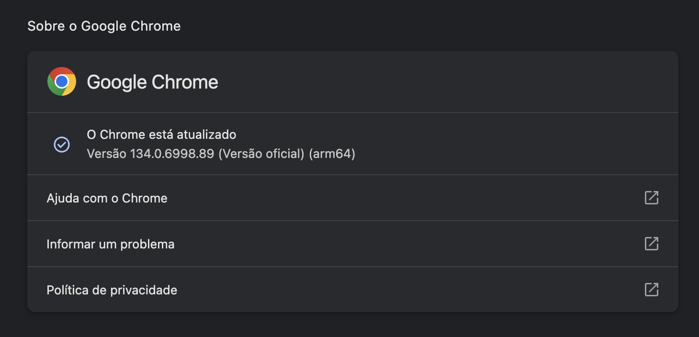
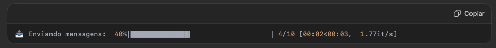

# Diário de estudos 

## Configuração ambiente

- ### Pylint

    - Instalação:
        - pip3 install pylint

    - Criando arquivo de configuração:
        - pylint --generate-rcfile > .pylintrc
        - obs.: configurar essa parte como preferir

        - Códigos adicionados para o pylint, não validar durante o processo de commit:
        
        >
            disable=
                C0114, # Missing-module-docstring
                C0115, # Missing-class-docstring
                C0116, # Missing-function-docstring
                C0321, # multiple-statements
                W0703, # Catching too general exception Exception
                W0719, # broad-exception-raised
                C0209, # Consider-using-f-string
                C0301, # Line too long
                C0303, # Trailing whitespace
                E0015, # unrecognized-option
                R0903, # Too few public methods

- ### Pre-commit

    - Instalação:
        - pip3 install pre-commit

    - Inicializando:
        - pre-commit install
        - obs.: Executar dentro da pasta raiz do projeto

    - Criar na raiz do projeto:
        - arquivo .pre-commit-config.yaml
        - adicionar as seguintes informações no arquivo:

        >
            repos:
                - repo: local
                    hooks:
                    - id: pylint
                        name: pylint
                        entry: pylint
                        language: system
                        types: [python]
                        args:
                        [
                            "-rn", # Only display messages
                            "-sn", # Don't display the score
                            "--rcfile=.pylintrc", # Link to your config file
                            "--load-plugins=pylint.extensions.docparams", # Load an extension
                        ]

## [Padrões de commits](https://github.com/iuricode/padroes-de-commits)
-
- A título de curiosidade e organização, o commit semântico possui os elementos estruturais abaixo (tipos), que informam a intenção do seu commit ao utilizador(a) de seu código.

    - feat- Commits do tipo feat indicam que seu trecho de código está incluindo um novo recurso (se relaciona com o MINOR do versionamento semântico).

    - fix - Commits do tipo fix indicam que seu trecho de código commitado está solucionando um problema (bug fix), (se relaciona com o PATCH do versionamento semântico).

    - docs - Commits do tipo docs indicam que houveram mudanças na documentação, como por exemplo no Readme do seu repositório. (Não inclui alterações em código).

    - test - Commits do tipo test são utilizados quando são realizadas alterações em testes, seja criando, alterando ou excluindo testes unitários. (Não inclui alterações em código)

    - build - Commits do tipo build são utilizados quando são realizadas modificações em arquivos de build e dependências.

    - perf - Commits do tipo perf servem para identificar quaisquer alterações de código que estejam relacionadas a performance.

    - style - Commits do tipo style indicam que houveram alterações referentes a formatações de código, semicolons, trailing spaces, lint... (Não inclui alterações em código).

    - refactor - Commits do tipo refactor referem-se a mudanças devido a refatorações que não alterem sua funcionalidade, como por exemplo, uma alteração no formato como é processada determinada parte da tela, mas que manteve a mesma funcionalidade, ou melhorias de performance devido a um code review.

    - chore - Commits do tipo chore indicam atualizações de tarefas de build, configurações de administrador, pacotes... como por exemplo adicionar um pacote no gitignore. (Não inclui alterações em código)

    - ci - Commits do tipo ci indicam mudanças relacionadas a integração contínua (continuous integration).

    - raw - Commits do tipo raw indicam mudanças relacionadas a arquivos de configurações, dados, features, parâmetros.

    - cleanup - Commits do tipo cleanup são utilizados para remover código comentado, trechos desnecessários ou qualquer outra forma de limpeza do código-fonte, visando aprimorar sua legibilidade e manutenibilidade.

    - remove - Commits do tipo remove indicam a exclusão de arquivos, diretórios ou funcionalidades obsoletas ou não utilizadas, reduzindo o tamanho e a complexidade do projeto e mantendo-o mais organizado.

## Ordem das Operações no Python

- A ordem das operações em python, seguem a mesma ordem e a mesma lógica da matemática mesmo.
- Por exemplo:
    - print(1 + 2 * 2), resultaria em 5, pois, seria resolvido primeiro a multiplicação para depois a soma.
    - se caso, fosse necessário realizar a soma antes, seria preciso colocar um parênteses envolvendo a soma, como da seguinte forma:
        - print((1+2) * 2)

## Tipos de Varíaveis em Python
- Qualquer coisa em python pode ser uma varíavel
- As varíaveis são objetos
    - Varíaveis de tipos diferentes, vão ter métodos diferentes.
- Não pode ou não é recomendado ficar mudando o tipo da varíavel o tempo todo

## Métodos de String
 - Método é uma fórmula/ação que é feito em determinado texto.
 - Todos os métodos do python, funcionam no formato texto.método()

 ### capitalize()
 - Coloca a 1˚ letra maiúscula
    >
        texto = 'brunno'
        print(texto.capitalize())

        Resultado: 'Brunno'

### casefold()
- Transforma todas as letras em minúsculas(existe lower(), mas o casefold é melhor normalmente)

    >
        texto = 'Brunno'
        print(texto.casefold())

        Resultado: 'brunno'

### count()
- Quantidade de vezes que um valor aparece na string

    >
        texto = 'brunnomanducarfe@gmail.com'
        print(texto.count('.'))

        Resultado: 1

### endswith()
- Verifica se o texto termina com um valor especifico e da como resposta True ou False

    >
        texto = 'brunnomanducarfe@gmail.com'
        print(texto.endswith('gmail.com'))

        Resultado: True

### find()
- Procura um texto dentro de outro texto e dá como resposta a posição do texto encontrado.

    >
        texto = 'brunnomanducarfe@gmail.com'
        print(text.find('@'))

        Resultado: 16

        Obs.: lembrando de como funciona a posição nas strings, então o @ está na posição 16
        b r u n n o m a n d  u  c  a  r  f  e  @  g  m  a  i  l  .  c  o  m
        0 1 2 3 4 5 6 7 8 9 10 11 12 13 14 15 16 17 18 19 20 21 22 23 24 25

### rfind()
- Retorna o índice da última ocorrência da substring.
- Útil quando você precisa localizar a última ocorrência de uma substring ou quer buscar de trás para frente em uma string, especialmente ao lidar com textos longos ou buscar delimitadores em uma posição específica.
- Sintaxe:
    >
        str.rfind(sub[, start[, end]])

    - sub: a substring que você deseja encontrar
    - start(opcional): A posição inicial para começar a busca
    - end(opcional): A posição final até onde a busca deve ocorrer (exclusivo).


### format()
- Formata uma string de acordo com os valores passados.

    >
        faturamento = 1000
        print('O faturamento da loja foi de {} reais'.format(faturamento))

        Resultado: 'O faturamento da loja foi de 1000 reais'

### isalnum()
- Verifica se o texto é todo feito com caracteres alfanúmericos (letras e números) -> letra 
com acento e ç são considerados letras para essa função.

    >
        texto = 'João123'
        print(texto.isalnum())

        Resultado: True

        Obs.: Se o texto fosse 'Jo~ao' ou então 'Joao#' o resultado seria False

### isalpha()
- Verifica se um texto é todo feito de letras

    >
        texto = 'Brunno'
        print(texto.isalpha())

        Resultado: True

        Obs.: nesse caso se o texto fosse 'Joao123' o resultado seria False, porque 123
        não são letras

### isnumeric() -> Verifica se um texto é todo feito por números

    texto = '123'
    print(texto.isnumeric())

    Resultado: True

    Obs.: Existem os métodos isdigit() e isdecimal() que tem variações pontuais em caracteres
    especiais tipo textos com potências, mas para 99% dos casos eles não vão ser necessários.


### replace() -> Substitui um texto por outro texto em uma string.

    >
        texto = '1000.00'
        print(texto.replace('.',','))

        Resultado: '1000,00'

        Obs.: O replace precisa de 2 argumentos para funcionar. O 1˚ é o texto que você quer
        trocar. O 2˚ ;e o texto que você quer colocar no lugar daquele texto que você está
        tirando.

### split() -> Separa uma string de acordo com um delimitador em vários textos diferentes

    >
        texto = 'brunnomanducarfe@gmail.com'
        print(texto.split('@'))

        Resultado: ['brunnomanducarfe', 'gmail.com']

### splitlines() -> separa um texto em vários textos de acordo com os 'enters' do texto

    >
        texto = ''Olá, bom dia
        Venho por meio desse e-mail lhe informar o faturamento da loja no dia de hoje.
        Faturamento = R$2.500,00
        ''''

        print(texto.splitlines())

        Resultado = ['Olá, bom dia', 'Venho por meio desse e-mail lhe informar o faturamento da loja no dia de hoje.', 'Faturamento = R$2.500,00']

### startswith() -> Verifica se a string começa com um determinado texto

    >
        texto = 'BEB123456'
        print(texto.startswith('BEB'))

        Resultado: True

### strip() -> Retira caracteres indesejados dos textos. Por padrão, retira espaços extras no ínicio e no final

    >
        texto = ' BEB123456 '
        print(texto.strip())

        Resultado: 'BEB123456'

### title() -> Coloca a 1˚ letra de cada palavra em maiúscula

    >
        texto = 'brunno manduca do prado'
        print(text.title())

        Resultado = 'Brunno Manduca do Prado'

### upper() -> Coloca o texto todo em letra maiúscula

    >
        texto = 'beb1234'
        print(texto.upper())

        Resultado = 'BEB1234'


## Listas em Python
- são mutáveis.

### Estrutura:
- lista = [valor, valor, valor, ....]

    - Lista é um dos objetos mais importantes de Python
    - Quando importamos uma base de dados para o Python, normalmente ela é lida como uma 'lista' ou como alguma 'variação de lista'
    - Lista em Python foram feitas para serem homogêneas, apesar de aceitarem valores heterogêneos

### Juntando listas
- Para juntar duas listas existem duas forma de fazer esse processo:
    1. Método extend()
        - No método extend você vai estar editando a sua lista original
    2. Somando as duas listas
        - Normalmente quando é somado duas listas, vai ser criado uma nova lista para isso.

## Strings em Python
- Todas as strings por debaixo dos panos são consideradas listas de caracteres, porém, a única diferença para uma lista mesmo, é que as strings não são mutáveis, ou seja, não podem ser alteradas.

    >
        email = brunnomanducarfe@gmail.com
        # incorreto
        email[5] = 'a'
        # correto
        email = email.replace('o', 'a')
        print(email)

        Resposta: brunnamanducarfe@gmail.cam

## Enumerate
- O enumerate permite que você percorra uma lista e ao mesmo tempo tenha em uma variável o índice daquele item.

    >
        for i, item in enumerate(lista):
            restante do codigo...


## While

- O uso do while se define em repetir um código de forma indeterminada até uma condição se tornar verdadeira/falsa
- A lógica é: enquanto a condição for verdadeira, o while executa o código. Assim que ele terminar de ser verdadeira, o código 'sai' do while.

    >
        while condicao:
            repete o codigo

## Tuplas
- estrutura: tupla = (valor, valor, valor, ...)
- Diferença: parece uma lista mas é imutável.
- Vantagens:
    1. Mais eficiente (em termos de performance)
    2. Protege a base de dados (por ser imutável)
    3. Muito usado para dados heterogêneos

- unpacking: 
    - ação de desmembrar os itens de uma tupla
    - podemos fazer da seguinte forma:
        >
            vendas = ('Lira', '25/08/2020', '15/02/1994', 2000, 'Estagiário')

            nome, data_contratacao, data_nascimento, salario, cargo = vendas

- enumerate:
    - Cria uma tupla, da sguinte forma:
        >
            for i, venda in enumerate(vendas):
                print(f'{funcionarios[i]} vendeu {venda} unidades')


## Dicionários

- Estrutura

    >
        dicionario = {chave: valor, chave: valor, chave: valor, chave: valor, ...}


- **Vantagens e desvantagens**
    1. Não devem ser usados para pegar itens em uma determinada ordem
    2. Podem ter valores heterogêneos (vários tipos de valores dentro de um mesmo dicionário: inteiros, strings, listas, etc.)
    3. Chaves são únicas obrigatoriamente
    4. Mais intuitivos de trabalhar.

- **Método keys()**
    - 'Pega' todas as chaves do dicionário
    - porém ao aplicar o método keys, nos criamos uma dict_keys
    - para 'transformar' o resultado em uma lista realmente:
        - isto serve tanto para o método keys quanto para o values
        >
            lista_chaves = list(dicionario.keys())

- **Método values()**
    - 'Pega' todos os valores do dicionário
    - porém ao aplicar o método values, nos criamos uma dict_values


## Iterables
- O que é?
    - Explicação não programadora: Um iterable é uma estrutura que armazena dados que podem ser 'iterada', ou seja, que você pode fazer um loop com um for dentro dela e ir passando de item a item. É como se fosse um tipo de lista de coisas que você pode ir olhando cada um dos elementos dentro dela.

## Set
- Basicamente é uma lista de informações, em que essas informações não tem uma ordem definida, ou seja, elas podem vir em qualquer ordem.
- Vantagem: Não pode ter valores duplicados
    >
        meu_set = {valor, valor, valor, ....}

## Functions
- As functions são blocos de código que servem para um 1 único propósito: fazer uma ação específica.

- Estrutura básica
    >
        def nome_funcao():
            faca alguma coisa
            faca outra coisa
            return valor_final

- Formas de passar um argumento para uma function:
    1. Em ordem -> positional argument
        >
            def program(arg1, arg2):
                seu codigo...

            program(cor1, cor2)
        
        - desta forma, o arg1 automaticamente será a cor1 e o arg2 será a cor2
    
    2. Com o nome do argumento (keyword argument)
        >
            def verificar_categoria(bebida, cod_categoria):
                bebida = bebida.upper()
                if cod_categoria in bebida:
                    return True
                else:
                    return False

            produtos = ['CAR46275','TFA23962','TFA64715','TFA69555','TFA56743','BSA45510','TFA44968','CAR75448','CAR23596','CAR13490','BEB21365','BEB31623','BSA62419','BEB73344','TFA20079','BEB80694','BSA11769','BEB19495','TFA14792','TFA78043','BSA33484','BEB97471','BEB62362','TFA27311','TFA17715','BEB85146','BEB48898','BEB79496','CAR38417','TFA19947','TFA58799','CAR94811','BSA59251','BEB15385','BEB24213','BEB56262','BSA96915','CAR53454','BEB75073']

            for produto in produtos:
                if verificar_categoria(cod_categoria = 'BEB', bebida = produto):
                    print('Enviar {} para setor de bebidas alcóolicas'.format(produto))
                elif verificar_categoria(produto, 'BSA'):
                    print('Enviar {} para setor de bebidas não alcóolicas'.format(produto))

## Docstrings e Annotations
- Quando criamos uma função, normalmente não seremos as únicas pessoas a usarem essa função e também pode ser que a gente precise usar a mesma função semanas, meses ou até anos depois da sua criação.
- Por isso é importante usarmos DOcStrings e Annotations:
    1. Docstring: Diz o que a função faz, quais os valores ela tem como argumento e o que significa cada valor.
    2. Annotation: Diz o que devem ser os argumentos e o que a função retorna.
- Em muitas empresas, o time de tecnologia vat ter um padrão que você deve seguir para isso, caso não tenha, abaixo tem um padrão que pode ser utilizado

- ### Docstring
    >
        def minha_soma(num1, num2, num3):
            ''' 
                Faz a soma de 3 número inteiros e devolve como resposa um número inteiro

                Parameters:
                    num1 (int): primeiro número a ser somado
                    num2 (int): segundo número a ser somado
                    num3 (int): terceiro número a ser somado

                Returns:
                    soma (int): o valor da soma dos 3 números dados como argumento.
            '''

            return num1 + num2 + num3

- ### Annotation
    >
        def minha_soma(num1: int, num2: int, num3: int) -> int:
            return num1 + num2 + num3

## Quantidade indefinida de argumentos
- Utilidade: quando você quer permitir uma quantidade indefinida de argumentos, usa o * para isso
- Estrutura:
    >
        # *args para positional arguments -> argumentos que vêm em formato de tupla
        def minha_soma(*numeros):
            print(numeros)
            soma = 0
            for numero in numeros:
                soma += numero
            return soma

    >
        # **kwargs para keywords arguments -> argumentos que vem em formato de dicionário
        def minha_funcao(**kwargs):
            ...


## Ordem de argumentos
- Estrutura:
    1. Sempre os positional arguments vêm antes e depois os keywords arguments
    2. Sempre os argumentos individuais vem antes e depois os múltiplos

    >
        def minha_funcao(arg1, arg2, arg3, *args, k = kwarg1, k2 = kwarg2, k3 = kwarg3, **kwargs)
            ...

## List Comprehensions
- É uma forma de iterar pelos elementos das listas de uma maneira 'mais direta', com mais 'cara de Python'
- Em resumo: É como se você fizesse um for em uma linha de código.

- ### Observação importante
    - Você não precisa de List comprehension para programar, todos os problemas resolvidos através do uso de List comprehension pode ser realizado com as outras formas já aprendidas no python
    - Não será possível sair de uma hora para outra fazendo tudo de list comprehension ao invés de for, porque realmente é mais confuso
    - O objetivo qual é:
        1. Saber ler e entender o que está acontecendo quando ver list comprehension(principal)
        2. A medida do tempo que você vai se acostumando com isso, vendo mais, usando mais e vai fazer naturalmente quando precisar.

## Orientação a Objetos e Porque isso importa

- ### Introdução a Orientação a Objetos
    
    - Regras gerais:
        - Tudo no python é um objeto
            1. String é objeto
            2. Lista é objeto
            3. Dicionários são objetos
        - Cada objeto possui vários métodos

    - Qual a grande vantagem de saber a orientação a objetos?
        - É possível importar importar módulos novos
        - Então tem muitas coisas que já estão prontas no Python que a gente não precisa programar do zero, iriámos simplesmente sair utilizando.
        - Ao importarmos, o que realmente estaremos fazendo é importar 1 ou mais objetos que tem vários métodos já prontos para serem utilizados.

- ### Módulos
    - Importância:
        - Já tem muita coisa pronta, então você não precisa criar do zero
        - Se você souber usar Módulos e como usar um módulo novo, você vai conseguir fazer praticamente tudo no python

    - Importando módulos
        - import Nome_modulo
        - import nome_modulo as nome_abreviado
        
    - Importando partes/funções especificas dos módulos
        - from modulo import funcao1, funcao2
    
    - Importando todas as funções
        - from modulo import *

- ### Módulo datetime()
- Módulo que fornece classes para manipulação de datas e horas

- ### Módulo collections
- Módulo collections implementa tipos de dados de contêineres especializados que fornecem alternativas aos contêineres embutidos do Python: dict, list, set e tuple
    - função Counter()
        - Subclasse de dict para contar objetos hasheáveis
        - um objeto é hasheável se tem um valor que nunca muda durante seu ciclo de vida(precisa ter
        um método __hash__()) e pode ser comparado com outros objetos(precisa ter um método __eq__()). Objetos hasháveis
        que são comparados como iguais devem er o mesmo valor de hash.
        - A hasheabilidade faz com que o objeto possa ser usado como uma chave de dicionário e como um membro de conjunto, pois estas estruturas de dados utilizam os valores de hash internamente.

- ### Módulo keyboard
    - Módulo que assume o controle do teclado em si
    - Módulo bem interessante para automações

- ### Módulo numpy
    - NumPy -> significa Numerical Python
    - É uma poderosa biblioteca da linguagem de programação python, que consiste em objetos chamados de arrays(matrizes),
    que são multidimensionais.
    - Além disso, essa biblioteca vem com uma coleção de rotinas para processar esses arrays.
    - NumPy forence um grande conjunto de funções e opreações de biblioteca que ajudam os programadores a executar facilmente cálculos númericos. Esses tipos de cálculos númericos são amplamente utilizados em tarefas como:
        - Modelos de Machine Lerning
        - Processamento de Imagem e Computação Gráfica
        - Tarefas matemáticas
    - Bastante voltado para quem trabalha com gráficos, com dados...
    - Estatísticas, previsões...

- ### Módulo matplotlib
    - pyplot.plot
        - [Documentação pyplot lib](https://matplotlib.org/stable/api/_as_gen/matplotlib.pyplot.plot.html)
    
    - pyplot.figure
        - [Documentação pyplot figure](https://matplotlib.org/stable/api/_as_gen/matplotlib.pyplot.figure.html#matplotlib.pyplot.figure)


- ### Lambda expressions
    - São funções anônimas (sem realmente tem um nome) e que tem uma única linha de código e são atribuídas a uma variável, como se a variável virasse uma função
    - Normalmente são usadas para fazer uma única ação, mas em Python usamos principalmente dentro de métodos como argumento, para não precisarmos criar uma função só para isso.
    

- ## NumPy()
- Biblioteca bastante relevante para quem vai trabalhar com dados
- É uma biblioteca que fornece um objeto array multidimensional, vários objetos derivados (como arrays mascarados e matrizes) e uma variedade de rotinas para operações rápidas em arrays, incluindo matemática, lógica, manipulação de formas, calificação, seleção, I/O, 'discrete Fourier transforms', álgebra linear básica, operações estatísticas básicas, simulação aleatória e muito mais.
- NumPy é usado no núcleo de muitos pacotes populares no mundo de Data Science e machine learning.
- instalação: !pip3 install numpy
- estrutura básica do NumPy é o array


- ### Diferenças entre listas e arrays:
    - **Tipos de dados**: As listas podem armazenar elementos de tipos diferentes ao mesmo tempo, enquanto os arrays armazenam elementos do mesmo tipo
    - **Operações matemáticas**: Você porde realizar operações matemáticas em todos os elementos de um array de uma vez, o que não é possível com listas.
    - **Desempenho**: Arrays são mais eficientes em termos de memória e desempenho do que listas quando se trabalha com grandes quantidades de dados númericos.
    - **Funcionalidades**: NumPy arrays vêm com várias funções integradas para operações matemáticas e ciêntificas, como média, soma, multiplicação de matrizes, etc., que não estão disponíveis com listas.

- ### Funções presentes no NumPy
    - np.sum() -> Somar todos os elementos de um array.
    - np.mean() -> Utilizada para calcular a média de um array.
    - np.max() -> Utilizado para encontrar o valor máximo em um array.
    - np.min() -> Utilizado para encontrar o valor mínimo em um array.
    - np.sort() -> Utilizado para ordenar os elementos de um array.
    - np.dot() -> Utilizado para calcular o produto escalar de dois arrays. Exemplo: Em uma empresa de varejo, você pode calcular o valor total de vendas, dado o número de cada produto vendido e o preço unitário de cada produto.

- ### Números aleatórios e estatística básica
    - Objeto gerador: para criar um objeto gerador, é utilizado por convenção, a abreviação rng(random generator)
        - rng = np.random.default_rng()
    - O número gerado pelo random, sempre será entre 0 e 1, ou seja, um número float
        - Para que o valor random por exemplo seja entre 0 e 10, basta multiplicar o rng.random() por 10
    - Gerando um array de números aleatorios
        - array_aleatorio = rng.random(3)
    - Gerando dados aleátorios
        - Criamos primeiramente o objeto gerador -> rng = np.random.default_rng()
        - E como parâmetro para o objeto gerador, passamos o seed, que é usado para inicializar o gerador de números pseudoaleatórios
            - rng = np.random.default_rng(seed=0)
        - Ele define o estado inicial do gerador, garantindo que os números aleatórios gerados sejam reproduzíveis.
        - após definir o valor do seed, os números aleátorios gerados se tornaram meio que fixos, para facilitar a reprodução 
        - Muitos pessoas utilizam o valor 42 para o seed e isso vem do livro mochileiro das galáxias, aonde em uma parte do livro foi criado um super computador e o mesmo disse que a resposta da vida/universo é 42

    
- ### Desvio padrão
    - É uma medida estatística que quantifica a quantidade de variação ou dispersão dos valores de um conjunto de dados.
    - Ele indica o quanto os valores se afastam da média (ou média aritmética) desse conjunto.


- ### Função np.reshape()
    - re -> alterar | shape -> forma
    - É usada para alterar a forma de um array.

- ## Pandas
    - Biblioteca/módulo
    - É a ferramenta número 1, usado para análise de dados
        - Seja para ler um arquivo excel
        - Seja para ler uma base de dados(csv)
    - Melhor biblioteca/módulo para ttabalhar com quantidades enormes de informações
    - Uma mistura de listas e dicionários de forma muito eficiente


    - ### DataFrames
        - Objeto do pandas, que essencialmente é uma tabela
        - As colunas funcionam "como dicionários"
            - ao passarmos nome_dataframe['nome_coluna'] -> estaremos acessando os valores presente em nome_coluna
        - As linhas funcionam "como listas"
            - para ver os registros de maneira completa posso fazer da seguinte forma: nome_dataframe[:n]
                - aonde o n seria um número especifico de linhas
            - caso seja colocado nome_dataframe[0], ocorrerá um erro, pois é preciso seguir o padrão nome_dataframe[:n]
        - método merge
            - método para mesclar bases


    - value_counts()
        - Contar quantas linhas determinado elemento aparece

    - Obs.: para realizar os exercícios da aula 23 do módulo 22, precisa baixar o arquivo: https://drive.google.com/file/d/1OhNIiehscfd3f-AD1IVkAJ73zGcdOP3b/view

    - ### [to_datetime](https://pandas.pydata.org/docs/reference/api/pandas.to_datetime.html)
        - função que converte uma string de data em um objeto datetime
        - [Formatação](https://docs.python.org/3/library/datetime.html#strftime-and-strptime-behavior) de código que pode auxiliar no format do to_datetime

## Seaborn
- Biblioteca gráfica de visualização de dados
- Construída em cima do matplotlib
- Este módulo vem para agregar várias ferramentas relacionadas a estatísticas e análise de dados, em cima de dataframes voltados para o pandas.

## python-docx
- Pacote para realizar integração do python com word

## PyPDF2
- Biblioteca(ferramenta) que essencialmente manipula todo o PDF
- Funcionalidades:
    - Mesclar dois PDFs
    - Separar vários arquivos em PDFs
    - Pegar um texto específico do PDF
    - Pegar uma página e colocar no meio das duas
    - Inverter a direção da página

## Tabula
- Biblioteca voltada para trabalhar com tabelas
- Funcionalidades:
    - Extrair tabelas do PDF e transformar as mesmas em Dataframes do python
- O tabula.read_pdf("endereço_do_pdf") => retorna uma lista de tabelas
- O tabula consegue ler mais de uma tabela por página
- O Padrão do tabula é retornar uma lista de tabelas


## Python e Arquivos do Computador

- Os módulos os e pathlib são uns dos melhores módulos/bibliotecas para controlar as pastas do seu computador.
- O pathlib costuma funcionar muito bem independente do sistema operacional que está sendo utilizado.

### Acessando local/diretório de arquivos

```

from pathlib import Path

# acessando diretório completo através do comando Path.cwd()
# print(Path.cwd())

# existem duas maneiras de 'pegar' o caminho especifico/completo de uma pasta/diretorio
# 1˚ -> definindo o caminho de uma pasta específica
caminho_arquivos_lojas = Path('/Users/brunnomanduca/Documents/Repositórios/MyGithub/hashtag_python_impressionador/módulos/módulo26/Modulo26 Aula 01/Arquivos_lojas')

# 2˚ -> utilizar o caminho padrão, que pode ser visto pelo comando Path.cwd()
# e passar para a função Path(), somente o caminho relativo do diretorio
caminho_arquivos_lojas2 = Path('Arquivos_Lojas/')

# listando todos os arquivos de uma pasta
arquivos = caminho_arquivos_lojas2.iterdir()

for arquivo in arquivos:
    print(arquivo)

```

### Verificando se um determinado arquivo existe no diretório

- **existem duas formas para verificar se um arquivo existe**

- #### 1˚ construindo um if para realizar a verificação

```

if Path('Arquivos_Lojas/202002_Amazonas Shopping_AM.csv').exists():
    print('Existe!')

```

- #### 2˚ utilizando um caminho que ja foi definido anteriormente e juntando com o Path do arquivo em si
```
caminho_arquivos_lojas2 = Path('Arquivos_Lojas/')

if (caminho_arquivos_lojas2 / Path('202002_Amazonas Shopping_AM.csv')).exists():
    print("Existe!")

```


### Módulo Shutil
- Módulo voltado para ações de manipulações de arquivos, como copiar, colar, mover arquivos de lugares..


## Integração Python - E-mail

- SMTP
    - Protocolo que os e-mails utilizam de mensagem para fazer envio e recebimento de mensagem, sejam, 
    mensagens com cópia, cópia oculta, anexo, imagem e etc.
    - Para envio de e-mails em massa, geralmente são feitos apartir de serviços terceirizados, como Sendgrid da Twillio,
    o Postmark e outros.


- Criando uma mensagem de email
```
import email.message

# email.message -> biblioteca email é a que permite construir uma mensagem
de email
msg = email.message.Message()

```

- Efetuando [conexão com servidor](https://kinsta.com/pt/blog/servidor-smtp-gmail/)
    - conexão é feita da seguinte forma:
        - servidor = smtplib.SMTP("endereço_servidor", "porta")
            - endereco_servidor -> link de endereco do servidor
            - porta -> porta usada para fazer envio do e-mail
        - servidor.starttls()
            - starttls -> formato de criptografia que os emails usam para enviar mensagem entre si
        - servidor.login(user_login, email_senha)
            - user_login -> usuário para acessar o email
            - email_senha -> senha do email
        - servidor.send_message(msg)
            - send_message() -> realizar propriamente o envio da mensagem para os emails selecionados
        - servidor.quit()
            - fechar conexão

## Lendo/Extraindo informações de um email

- Protocolo IMAP
    - para utilizar basta instalar -> pip3 install imap-tools

- efetuando conexao com caixa de entrada do email, através do login
    - Utilizamos a função MailBox que é importando da biblioteca imap_tools:
        ```
            meu_email = MailBox("imap.gmail.com").login(email_usuario, email_senha)
        ```
    - Para pegar uma lista de emails, podemos fazer através do comando fetch, da seguinte forma:
        ```
            lista_emails = meu_email.fetch(AND(from_="email_emissor@gmail.com", to="email_destinatario@gmail.com"))
        ```
        - no fetch, iremos passar o parâmetro AND, que também é importando da biblioteca imap_tools e em conjunto com 
        esse parâmetro, são passados alguns critérios de seleção. Para um melhor conhecimento de todos os critérios
        que podem ser utilizados, basta acessar a página da biblioteca [imap_tools](https://pypi.org/project/imap-tools/#search-criteria)
        

## Sendgrid Twillio
- O Sendgrid é um serviço de envio de e-mails baseado na nuvem, utilizado para enviar e-mails transacionais e de marketing
em grande escala. Ele fornece APIs para integração com diversas aplicações, permitindo o envio seguro e eficiente de 
e-mails.
- Em python existem duas formas de utilizar o mesmo:
    ```
        # - Através de Requisições (requests, get, post, patch, delete)
        # - Utilizando a Biblioteca (sendgrid)
    ```

## SQL
- É uma liguagem usada para criar e interagir com banco de dados.
- Efetuar criação de banco de dados e ler/consultar banco de dados

- ### Biblioteca pyodbc
    - Permite que o python seja integrado com qualquer tipo de banco de dados SQL, ou seja, SQL Server, MySQL, Oracle, Access, IBM, Postgres SQL e etc.
    - CRUD
        - Create
        - Read
        - Update
        - Delete
    - instalação(MacOS Chip M1)
    ```
        brew tap microsoft/mssql-release https://github.com/Microsoft/homebrew-mssql-release
        brew update
        brew upgrade
        HOMEBREW_ACCEPT_EULA=Y brew install msodbcsql18 mssql-tools18

        pip3 install --pre --no-binary :all: pyodbc
    ```

- ### DB Browser
    - Gerenciador de Banco de dados
    - Instalação Mac (opcional)
        - brew install db-browser-for-sqlite
        
- ### Aviso sobre conexões com Banco de Dados
    - Após finalizar as edições com banco de dados, no final do código, é necessário fechar o cursor e a conexão com o banco de dados, ou seja, finalizar a integração feita entre o Python e o SQL.
        ```
            cursor.close()
            conexao.close()
        ```
    - O Problema: Ao rodar o código sem fechar o cursor e a conexao, o mesmo ficará eternamente rodando

- ### Efetuando conexão via biblioteca do sqlite3 no Mac Chip M1
    - para a situação tratada acima, foi aplicada a devida solução:
        ```
            import sqlite3

            conexao = sqlite3.connect('NomedoDatabase.sqlite')
            print('Conexão efetuada com sucesso.')

            cursor = conexao.cursor()

            # fechando o cursor e a conexao com o Database ao final do código
            cursor.close()
            conexao.close()
        ```

## Pre-commit
- O pre-commit é uma ferramenta essencial para garantir a qualidade do código antes que ele seja enviado para o repositório (antes do commit).
- Ele automatiza a execução de ferramentas como black, flake8, isort, mypy, entre outras.

- Instalação
    - pip3 install pre-commit

- Criando arquivo de configuração pylintrc
    - pylint --generate-rcfile > pylintrc

- Criar o arquivo .pre-commit-config.yaml
```
    repos:
  - repo: local
    hooks:
      - id: pylint
        name: Run Pylint
        entry: pylint
        language: system
        types: [python]
        args:
          [
            "-rn", # Only display messages
            "-sn", # Don't display the score
            "--rcfile=.pylintrc", # Link to your config file
            "--load-plugins=pylint.extensions.docparams", # Load an extension
          ]
```

- Instalar o hook no git
    * pre-commit install
    &nbsp;

- Testar o hook manualmente (opcional)
    * pre-commit run pylint --all-files
    &nbsp;

- Enviar Commit sem a verificação
    * commit -m "message" --no-verify
    &nbsp;

## Criando Tabela através de um SQL Script

```
    CREATE TABLE `bdyoutube`.`Vendas` (
        `idVendas` INT NOT NULL AUTO_INCREMENT,
        `nome_produto` VARCHAR(100) NULL,
        `valor` INT NOT NULL,
        PRIMARY KEY (`idVendas`)
    );
```


## SQLAchemy
- É uma biblioteca poderosa para Python que facilita a interação com banco de dados Relacionais, como MySQL, PostgreSQL, SQLite, entre outros. Ele é muito usada no desenvolvimento de aplicações web, APIs e sistemas que precisam armazenar e manipular dados em bancos SQL

    - ### Principais características do SQLAlchemy
        1. ORM (Object Relational Mapper)
            - Permite mapear tabelas do banco de dados como classes Python. Assim, você trabalha com objetos em vez de escrever SQL puro.

            Exemplo:
            ```
                class User(Base):
                __tablename__ = 'users'
                id = Column(Integer, primary_key=True)
                name = Column(String)
            ```

        2. SQL Expression Language
            - Além do ORM, o SQLAlchemy permite escrever SQL de forma programática, usando Python, com total controle sobre as queries.

        3. Abstração do Banco de Dados
            - Você pode trocar o banco de dados (ex.: de SQLite para PostgreSQL) sem precisar reescrever o código de interação com o banco, bastando mudar a string de conexão.

        4. Gerenciamento de Sessões
            - Trabalha com um sistema de sessões para manter o controle sobre as transações e as conexões abertas com o banco
            
        ***

        - ### Exemplo básico de uso
        ```
            from sqlachemy import create_engine, Column, Integer, String
            from sqlachemy.ext.declarative import declarative_base
            from sqlachemy.orm import sessionmaker

            # Conexão com o banco
            engine = create_engine('sqlite:///meubanco.db')
            base = declarative_base()

            # Definindo uma tabela como classe
            class User(Base):
                __tablename__ = 'users'
                id = Column(Integer, primary_key=True)
                name = Column(String)

            # Criar as tabelas
            Base.metadata.create_all(engine)

            # Criar a sessão
            Session = sessionmaker(bing=engine)
            session = Session()

            # Inserir um novo usuário
            novo_usuario = User(name='Brunno')
            session.add(novo_usuario)
            session.commit()
        ```

    
    - ### ⚙️ Para que serve na prática?
        * Facilitar o CRUD (Create, Read, Update, Delete) com menos código e mais segurança.
        * Evitar SQL Injection.
        * Trabalhar de forma mais intuitiva com dados complexos, relacionamentos (um-para-muitos, muitos-para-muitos).
        * Integrar com frameworks como Flask e FastAPI.


## Automação Web (Web-Scraping com Selenium)
- **O que é Web-Scraping**
    - É um processo/técnica de automatizar tarefas dentro do navegador(sites acessados)
    - Esse processo pode ser utilizado para fazer raspagem de dados, ou seja, percorrer um ou mais páginas para coletar informações, como também, é possível enviar informações, como um processo diário de preencher formulários.

- **Selenium**
    - Biblioteca que permite a conexão com o navegador. 

    - **Instalação**
        - pip3 install --upgrade selenium


    * Obs.: Para uma questão de compatibilidade todos os testes e aplicações aqui foram utilizados no Chrome

    - Instalando Chrome (MacOS)
        - 1. Acessar: https://www.google.com/chrome/
        - 2. Efetuar download do navegador
        - 3. Abrir o arquivo .dmg
        - 4. Arrastar o chorme para pasta Applications

    - Instalando o ChromeDriver (MacOS)
        1. Verificar a versão do Chrome que está sendo utilizado
            1. Acessar **Configurações do chrome**
            2. Acessar **Sobre o Google Chrome**
            3. Verificar a versão do Chrome como a imagem a seguir
            
        2. Acessar [página download ChromeDriver](https://googlechromelabs.github.io/chrome-for-testing/#stable)
        3. Baixar a versão compatível com o seu Chrome
        4. Extrarir o arquivo e mover para o diretório aonde esteja instalando o python em sua máquina
            1. Para verificar, basta acessar terminal e efetuar seguinte comando:
                * ``` whereis python3 ```
            2. retorno será algo como: **/usr/local/bin/**
        5. Após, esste passo a passo, o seu ChromeDriver estará instalado.

    - Alternativa instalação e gerenciamento do ChromeDriver
        - Essa alterantiva é chamada de webdriver-manager, que é uma outra biblioteca que faz o gerenciamento do seu chromedriver. Nesse caso, é necessário instalar o webdriver-manager

        - Instalação: pip3 install webdriver-manager
        - Em seguida, so importar o ChromeDriverManager e usar no Serviço do nosso Selenium, da seguinte forma:
            ```
                from selenium import webdriver
                from selenium.webdriver.chrome.service import Service
                from webdriver_manager.chrome import ChromeDriveManager

                servico = Service(ChromeDriverManager().install())
                navegador = webdriver.Chrome(service=servico)
            ```

    - Selecionando o local de uma página local de maneira dinâmica
        - Podemos realizar esse processo atráves da biblioteca **os**
            ```
                import os
                
                caminho = os.getcwd()                
            ```
            - Desta forma, conseguimos armazenar o caminho do diretorio aonde está os arquivos que estáo sendo utilizados no momento.

    - Encontrando um elemento ou vários elementos dentro da página:
        ```
            # find_element vai retornar como resposta um único elemento da página
            navegador.find_element

            # o find_elements retorna uma lista com várioas itens da sua página
            navegador.find_elements
        ```

        - Principais atributos que podem ser utilizados para localizar elementos na página, através da classe By:
            1. ID
            2. NAME
            3. XPATH
                * É um tipo de código que vai te mostrar quem é o elemento na página

    - Selecionando vários elementos de uma vez, mas aplicando ação em um item específico

        ```
            import os
            from selenium import webdriver
            from selenium.webdriver.common.by import By

            navegador = webdriver.Chrome()

            caminho = os.getcwd()
            arquivo = caminho + "/Pagina Hashtag.html"
            # abrindo aquivo HTML presente no caminho especificado em arquivo
            navegador.get(rf"file:///{arquivo}")

            # criando uma lista com os os 'nav-links' encontrados
            list_navlink_elements = navegador.find_elements(By.CLASS_NAME, 'nav-link')

            for elemento in list_navlink_elements:
                if "blog" in elemento.text.lower():
                    elemento.click()
                    break # finalizar o loop, para evitar problema ou erros na execução
        ```


    - ActionChains
        * É uma classe que permite criar e executar uma sequência de ações avançadas do usuário, como cliques duplos, arrastar e soltar, mover o cursor, pressionar teclas modificadoras (Shift, Ctrl, Alt) e interações com menus suspensos
        * Ele é útil quando operações simples como click() ou send_keys() não são suficientes. Com o ActionChains, você pode encadear várias ações e executá-las de uma só vez.


    - Biblioteca urllib
        * Biblioteca nativa do Python
        * Trabaljha com URLs
        * Faz requisições HTTP simples (como GET, POST...)
        * Faz o parse (quebrar/analisar) de URLs
        * Baixar conteúdos da web (como imagens, arquivos, etc.)

    
## Biblioteca tqdm (taqaddum => "progresso")
* Uma biblioteca Python que serve para mostrar barras de progresso elegantes no terminal ou no Jupyter notebook.
* **Porque utilizar?**
    * Quando está em um loop com várias tarefas demoradas, como envio de mensagens WhatsApp Web, é interessante saber quanto já foi feito e quanto falta. É ai que o tqdm brilha :)
* Instalação
    * **pip3 install tqdm**
* Exemplo


* Linha de código
    ```
    for linha in tqdm(tabela.index, desc="📤 Enviando mensagens"):
    ```

## Web-Sraping com BeautifulSoup BS4
* BeautifulSoup é uma ferramenta de Web-Scraping
* Intuito de percorrer páginas em HTML, para extrair informações, **no limite** até modificar informações
* **Vantagens e Desvantagens com relação ao Selenium**
    * Vantagem:
        - É muito mais fácil de ligar/configurar suas propriedades
        - É mais rápido

    * Desvantagem:
        - So consegue trabalhar com páginas estáticas, com informações estáticas

    * ### Funcionamento do BeautifulSoup
        * O BeautifulSoup faz uma requisição na página
        * Essa página devolve pro BS uma resposta (código HTML que está por trás da página)
        * Armazena esse código dentro de uma variável no Python e apartir desse momento, não existe mais uma **conexão** com o site em si

* Biblioteca requests
    - biblioteca para fazer as requisições no site, ou seja, 'puxar' as informações do site
    - Os sites conseguem 'saber' que está sendo utilizado uma ferramenta para fazer essas requisições, neste caso, ferramenta para Web-scraping(raspagem de dados)
        - **Obs.:** Alguns sites não permitem isso
        - **Ex.:** Site da Amazon
        